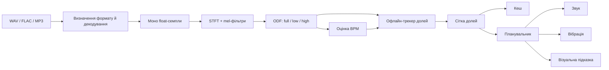

# tik-tak

[](https://github.com/9ThLen/Tik-Tak/actions/workflows/core.yml)
[](https://github.com/9ThLen/Tik-Tak/actions/workflows/desktop.yml)
[](https://github.com/9ThLen/Tik-Tak/actions/workflows/research.yml)

Метроном, який сам знаходить темп і долі в музиці — з аудіофайлу або, у
майбутньому, з мікрофона в реальному часі.

Мета проєкту — допомогти людині навчитися відчувати ритм і потрапляти в долю
під час співу. Замість звичайного метронома з наперед заданим BPM застосунок
аналізує саму музику, будує часову сітку долей і використовує її для
синхронізованих звукових, візуальних та тактильних підказок.

## Стан

Проєкт перебуває в активній розробці. Це вже не лише план: у репозиторії є
робоче портативне ядро, офлайн-аналіз аудіо, декодер, кеш результатів,
семплово-точний метроном, синхронне відтворення мінусовки, онлайн-трекер із
мікрофона й настільний стенд для перевірки затримки та джитера.

| Компонент | Стан |
|---|---|
| Потоковий DSP та onset detection function | ✅ Готово |
| Оцінка BPM й офлайн-трекінг долей | ✅ Готово |
| Декодування WAV, FLAC і MP3 | ✅ Готово |
| Кешування сітки долей | ✅ Готово |
| Планувальник подій і синтез кліку | ✅ Готово |
| Desktop-стенд: `devices`, `play`, `render`, `measure` | ✅ Готово |
| Python-еталон і автоматична перевірка паритету з C++ | ✅ Готово |
| Синхронне відтворення імпортованої мінусовки | ✅ Готово |
| Онлайн-трекер із мікрофона (auto) | ✅ Готово |
| Manual + sync: темп задає користувач, фазу знаходить застосунок | ✅ Готово |
| Сильна доля та довжина такту | ⚙️ Евристика й eval працюють; Beat This! `small0` закріплено, inference попереду |
| Облік ML-артефактів | ✅ Маніфест, SHA-256, офлайн-перевірка й research-шов |
| iOS та Android оболонки | ⏳ Заплановано |
| Аналіз потрапляння голосу співака в долю | ⏳ Заплановано |

Отже, алгоритмічна й таймінгова основа вже працює, але готового мобільного
застосунку для кінцевого користувача ще немає.

## Як працює програма

### Офлайн-аналіз аудіофайлу

1. **Отримання файлу.** Оболонка читає файл у байти. Ядро не залежить від
   файлових шляхів, тому однаково працює з iOS security-scoped URL, Android
   `content://` і звичайним файлом на комп'ютері.
2. **Визначення формату.** `tiktak_decode` перевіряє вміст, а не розширення,
   та приймає WAV, FLAC або MP3. Невідомі чи пошкоджені дані відхиляються,
   замість того щоб мовчки аналізувати шум.
3. **Декодування.** Аудіо перетворюється на моно-сигнал із числами `float`.
   Власне аналіз не знає, з якого контейнера або платформи надійшли семпли.
4. **Пошук музичних атак.** Потоковий STFT застосовує періодичне вікно Ганна,
   FFT і розріджений mel-фільтрбанк. Спектральний потік утворює onset detection
   function окремо для повного, низького та високого частотних діапазонів.
5. **Оцінка темпу.** Автокореляція ODF шукає періодичність, а лог-нормальний
   апріор допомагає розв'язати типову неоднозначність між, наприклад, 60 і
   120 BPM. API також повертає альтернативні кандидати й оцінку впевненості.
6. **Пошук долей.** Динамічне програмування будує послідовність часових міток,
   яка одночасно тримається біля очікуваного темпу та проходить через сильні
   музичні атаки. Результат — сітка долей у секундах.
7. **Межі такту.** Для кожної знайденої долі збираються ознаки: енергія
   низької смуги (бочка), величина ODF і зміна профілю висот (акорд змінюється
   на межі такту частіше, ніж будь-де всередині). Розмір і фаза вибираються
   разом, точним перебором пар «розмір × фаза» — за сталого розміру їх лише
   десяток, тож наближати нічого не треба. Результат супроводжується двома
   мірами довіри, і акцент ставиться лише тоді, коли межа такту справді в
   одному місці, а не просто десь кожні чотири долі.
8. **Кешування.** Сітка серіалізується в переносний бінарний блок. Ключем є
   SHA-256 від байтів закодованого файлу, тому перейменування не скидає кеш, а
   інший запис того самого треку не отримує застарілий результат. Конфігурація
   аналізу також входить до ідентичності кешу.
9. **Планування підказок.** Планувальник видає події наперед і окремо компенсує
   затримку звуку, вібрації та екрана. Синтезатор кліку ставить кожну подію на
   конкретний аудіосемпл.



На поточному етапі готові аналіз, сітка, планувальник і звуковий метроном.
Збереження кешу, відтворення мінусовки, вібрація та UI належатимуть платформним
оболонкам.

### Auto: музика з мікрофона

У цьому режимі аудіо надходить невеликими блоками без зупинки. Потоковий ODF і
particle tracker уже працюють у ядрі та на настільному стенді: вони адаптують
темп і фазу до живого виконання та продовжують прогноз крізь коротку тишу.
Незакриті частини — мобільне захоплення мікрофона, вимірювання на пристроях і
захист від синхронізації з власним кліком метронома.

### Manual + sync

Користувач задає BPM вручну, а застосунок слухає кімнату лише для того, щоб
знайти фазу. За відомого періоду це зводиться до однієї величини — концентрації
онсетів за модулем періоду, — тож ані буфера, ані перебору зсувів не потрібно.
Режим має право **відмовитися**: якщо в кімнаті немає долі на заданому темпі,
він мовчить, а не синхронізується з чим завгодно.

### Сильна доля та довжина такту

Офлайн-аналіз визначає довжину повторюваного циклу в імпульсах знайденої
сітки та те, з якого імпульсу починається такт, після чого клік акцентує першу
долю сам. Це поки що евристика на трьох ознаках, а не модель: вона працює на
матеріалі з виразною бочкою або зміною гармонії й чесно каже, коли не
впевнена. Офіційний Beat This! `small0` уже закріплено за SHA-256 як перший
офлайн-кандидат; наступні кроки — отримати його активації, порівняти з
евристикою на реальному наборі та лише тоді інтегрувати ONNX Runtime. BeatNet
лишається дослідницьким кандидатом для online-режиму, а не затвердженою
продуктовою залежністю.

Це розрізнення важливе для складених розмірів. Значення `6` зараз означає
шість імпульсів **поточної beat grid** на цикл, а не доведений музичний розмір
6/8. Трекер часто представляє 6/8 двома пунктирними чвертями; без окремого
аналізу субподілів така сітка невідрізненна від дводольної. Тому повноцінна
класифікація 6/8 ще не заявляється.

Двох речей ця частина ще не має, і це варто знати: якість перевірено на
синтетичних кліпах і одному згенерованому MP3, а не на реальних записах, і
поріг довіри, за яким акцент вимикається, вибрано з кількох спостережень, а не
відкалібровано на розміченому наборі.

Апарат для обох уже стоїть — `research/eval/` рахує точність розміру окремо від
фази та розгортає **два** пороги за покриттям і частотою помилкових акцентів.
Довіри теж дві: одна про те, з якої долі починається такт, друга про те, що
жоден інший розмір не підходить майже так само. Друга з'явилась не з проєкту, а
з вимірювання: без неї 4/4-трек, прочитаний як три, виглядав упевненим. Акцент
вмикається лише коли обидві пройшли, інакше клік рівний — рахувати четвірки від
першої долі означало б видати довільний акцент за знайдений.

Бракує самих записів: пілот можна почати з 30–50, але для фінальної
калібрації потрібно орієнтуватися приблизно на 200–300 незалежних реальних
груп (композиція/сесія/backing track). Уривків може знадобитися більше, бо
кілька пов'язаних уривків рахуються як одне статистичне спостереження. Eval
порівнює бюджет помилок із верхньою 95%-межею Wilson і відмовляється називати
поріг доведеним, коли матеріалу недостатньо. Формат розмітки й точні критерії
описані в `research/eval/README.md`.

## Режими

| Режим | Що отримує користувач | Поточний стан |
|---|---|---|
| **Файл** | Аналіз мінусовки, BPM, впевненість, часові мітки долей і межі такту | Готово в ядрі та на стенді |
| **Auto** | Метроном слідує за живим гуртом або інструментом через мікрофон | Готово в ядрі та на стенді |
| **Manual + sync** | BPM задається вручну, а фаза вирівнюється з музикою | Готово в ядрі та на стенді |

У фінальному застосунку три канали підказок мають працювати незалежно:

- **звук** — клік метронома з окремим акцентом сильної долі;
- **вібрація** — тактильна підказка без додаткового звуку;
- **екран** — візуальний пульс, корисний під час співу в навушниках.

## Архітектура

Логіка, яка має бути однаковою на всіх платформах, живе в портативному
C++17-ядрі. Платформні оболонки відповідають лише за файли, аудіопристрої,
збереження, UI та вібрацію.

| Шлях | Призначення |
|---|---|
| `core/` | DSP, аналіз темпу, трекінг долей, кеш, планувальник і метроном |
| `core/include/tiktak/` | Плоский C API для Swift, Kotlin/JNI та інших оболонок |
| `desktop/` | Стенд на miniaudio для реального відтворення й вимірювання |
| `research/` | Еталонна Python-реалізація, синтетичні дані та метрики |
| `tools/parity/` | Порівняння результатів Python і C++ на однаковому аудіо |
| `tools/eval/` | Дамп аналізу у JSON, щоб оцінювати саме те, що збирається |
| `docs/` | План, ADR та дослідження моделей |

`tiktak_core` не залежить від платформних SDK і сторонніх бібліотек.
Декодування винесене в окрему необов'язкову бібліотеку `tiktak_decode` на
основі dr_libs. Завдяки цьому мобільна оболонка може використати системний
декодер, не змінюючи аналіз.

### Правила real-time коду

Шлях, який виконується в аудіоколбеку, дотримується таких обмежень:

- жодних виділень пам'яті після створення об'єктів;
- жодних блокувань, файлового I/O чи винятків;
- результат не залежить від розміру аудіоблоку;
- час передається в планувальник явно, тому поведінку можна тестувати без
  очікування в реальному часі.

Офлайн-аналіз навмисно виконується поза аудіоколбеком: він може виділяти пам'ять
і обробляти цілий трек без ризику переривання звуку.

## Настільний стенд

Desktop-програма — інструмент розробки, а не фінальний UI. Вона використовує
той самий метроном, який згодом підключатиметься до мобільних оболонок.

```sh
tiktak devices
tiktak play --bpm 120 --seconds 30
tiktak render --bpm 137 --seconds 20 -o metronome.wav
tiktak measure --bpm 120 --seconds 30 -o recording.wav
```

- `devices` показує пристрої відтворення та запису;
- `play` запускає метроном на реальному аудіопристрої;
- `render` проганяє той самий аудіоколбек за віртуальним годинником і записує
  WAV без звукової карти;
- `measure` одночасно відтворює та записує кліки, після чого рахує середню
  кругову затримку й джитер. Потрібен loopback-кабель або колонки з мікрофоном.

Середню затримку можна компенсувати через `--latency-ms`; джитер компенсувати
неможливо, тому саме він є головним показником стабільності метронома.

## Збірка й тести

Потрібні Git, CMake 3.20+, компілятор C++17 і, бажано, Ninja. З кореня
репозиторію:

```sh
cmake -S core -B core/build -G Ninja -DCMAKE_BUILD_TYPE=RelWithDebInfo
cmake --build core/build
ctest --test-dir core/build --output-on-failure
```

Під час першої конфігурації CMake завантажує GoogleTest і dr_libs. Щоб зібрати
лише незалежне ядро без тестів, декодера й мережевих завантажень:

```sh
cmake -S core -B core/build-minimal -G Ninja -DTIKTAK_BUILD_TESTS=OFF -DTIKTAK_BUILD_DECODE=OFF
cmake --build core/build-minimal
```

Для Python-досліджень потрібен Python 3.11 або новіший:

```sh
python -m venv research/.venv
# Активуйте research/.venv відповідно до своєї оболонки.
python -m pip install -e "research[test]"
python -m pytest -q research
```

Перевірка паритету C++ і Python:

```sh
cmake -S tools/parity -B tools/parity/build -G Ninja -DCMAKE_BUILD_TYPE=RelWithDebInfo
cmake --build tools/parity/build
python tools/parity/check_parity.py
```

Збірка настільного стенда:

```sh
cmake -S desktop -B desktop/build -G Ninja -DCMAKE_BUILD_TYPE=RelWithDebInfo
cmake --build desktop/build
desktop/build/tiktak render --bpm 137 --seconds 20 -o metronome.wav
```

На Windows виконуваний файл багатоконфігураційного генератора може лежати в
`desktop/build/RelWithDebInfo/tiktak.exe`. Докладніше — у
**[desktop/README.md](desktop/README.md)**.

## Перевірка якості

- C++-тести перевіряють FFT, mel-фільтри, STFT, хрому, ODF, темп, трекер,
  визначення сильної долі й розміру, онлайн-трекер, декодер, кеш, C API,
  планувальник і семплово-точний клік.
- Матеріал тестів — синтетичні сигнали з відомою істиною та один згенерований
  MP3. Це доводить, що частини зібрані правильно, і **не** доводить якості на
  реальній музиці; для цього потрібен розмічений набір записів.
- Окремий CI-запуск використовує AddressSanitizer та UndefinedBehaviorSanitizer.
- Ядро кроскомпілюється для iOS і двох Android ABI, щоб платформні залежності
  не проникли в нього випадково.
- Desktop CI збирає Windows і Linux версії, рендерить 20 секунд на 137 BPM і
  перевіряє положення кожного кліку у WAV.
- Python-тести перевіряють дослідницьку реалізацію, а parity job порівнює з нею
  C++ на однакових сигналах.
- Eval розділяє пов'язані уривки як одну групу, показує 95%-межі Wilson і не
  калібрує поріг лише на підставі випадкових `0%` у малій вибірці.
- Workflow артефактів окремо тестується на Linux і Windows, включно з
  міжпроцесним блокуванням `flock`/`msvcrt`.

## Стек

- **Ядро** — C++17 і CMake; портативний DSP, dr_libs для декодування
- **Настільний стенд** — C++17 і miniaudio
- **Дослідження** — Python, NumPy, mir_eval
- **Заплановано** — SwiftUI/AVAudioEngine/CoreHaptics для iOS; Compose/Oboe для
  Android; ONNX Runtime для визначення сильної долі

## Документація

- **[docs/PLAN.md](docs/PLAN.md)** — архітектура, алгоритми, дорожня карта та
  ризики;
- **[core/README.md](core/README.md)** — внутрішня будова й API ядра;
- **[desktop/README.md](desktop/README.md)** — команди стенда, вимірювання та
  інтерпретація статистики;
- **[docs/adr/0001-portable-cpp-core.md](docs/adr/0001-portable-cpp-core.md)** —
  чому спільна логіка написана на C++;
- **[docs/adr/0002-native-ui.md](docs/adr/0002-native-ui.md)** — чому мобільні
  оболонки плануються нативними;
- **[docs/adr/0003-windows-host-no-mac.md](docs/adr/0003-windows-host-no-mac.md)** —
  навіщо потрібен настільний стенд.
